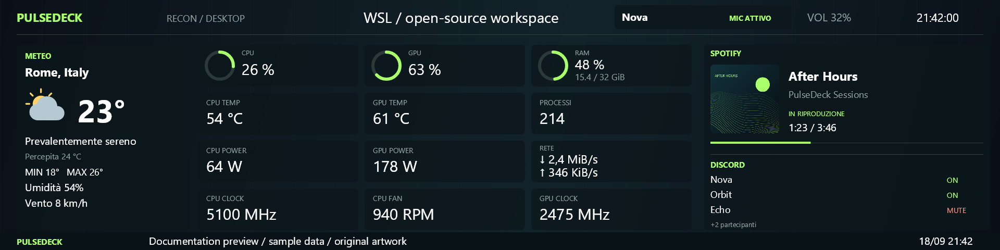
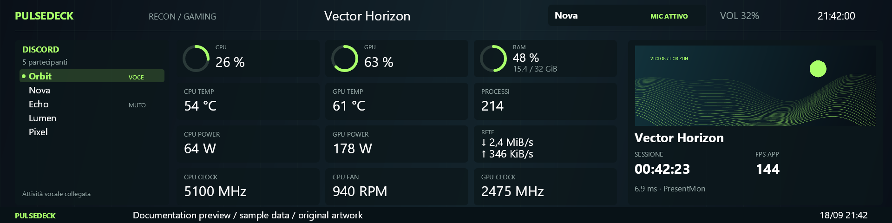
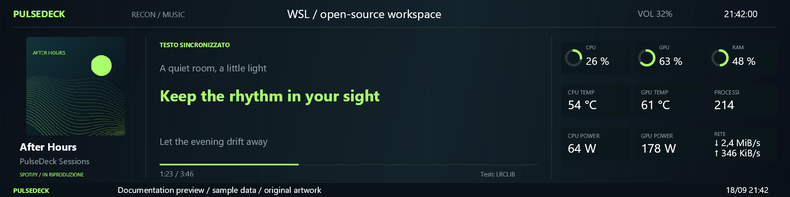
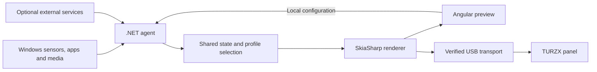

  
  
<strong>A Windows companion for your dedicated PC display.</strong> Hardware telemetry, game sessions, Discord and Spotify — where you can see them.

  

    
    
    
  

  
<a href="docs/getting-started.md">Get started</a> · <a href="docs/gallery.md">Gallery</a> · <a href="CONTRIBUTING.md">Contribute</a> · <a href="docs/roadmap.md">Roadmap</a> · <a href="docs/README.it.md">Italiano</a>

## What is PulseDeck?

PulseDeck turns a **TURZX 8.8″ 1920 × 480 USB panel** into a contextual dashboard for your Windows PC. It runs locally, gathers the information you choose, and switches between Desktop, Gaming and Music as you work, play and listen.

The browser configurator and physical panel share the **same renderer**. What you arrange in the preview is what the agent sends to the display. No PulseDeck account or hosted backend is required; optional weather, artwork, lyrics and Discord features contact their respective services.

**Early development, tested on one display revision.** The verified device is `chs_88inch.dev1_rom1.90`, USB `0525:A4A7`. Other sizes and revisions are not yet supported. The configurator and display labels are currently in Italian; localization is a welcome contribution.

## Three ways to use the same screen

### Desktop · Keep the essentials in view

CPU, GPU and RAM rings. Temperatures, power, clocks, fans and combined download/upload. Add weather and RSS headlines, or use the compact 16-widget layout. Unavailable readings stay visibly unavailable.

### Gaming · Follow the session

Discover games in Steam and EA libraries, show artwork, keep the session timer through Alt-Tab, and display application FPS from PresentMon. Discord speaking activity highlights the current speaker in the Gaming layout.

### Music · Give Spotify its own space

Spotify gets cover art, track progress and optional synchronized lyrics from LRCLIB, with nine sensors in a 3×3 grid. Track changes keep the layout stable while lyrics load. Automatic priority is **Gaming → Music → Desktop**; manual selection takes precedence.

*These are real renderer outputs using fictional names, sample readings and original artwork/lyrics. They are documentation previews, not hardware benchmarks or photographs. See [image provenance](docs/gallery.md).*

## Built for everyday use

| Capability | Available today |
| --- | --- |
| Hardware | LibreHardwareMonitor sensors, configurable values/bars/rings, temperature and power trends |
| Games | Steam/EA discovery, manual exceptions, per-game artwork, persistent session timer, application FPS |
| Voice | Discord channel roster, mute/deaf state and optional speaking activity |
| Media | Windows media sessions; optional Chrome extension prioritizes the main YouTube player |
| Spotify | Dedicated lyrics layout; other media sources keep the regular media panel |
| Artwork | Optional SteamGridDB key, Steam fallback, local cache and manual backgrounds |
| Daily controls | Volume, clock, foreground app or Terminal tab title, manual/automatic profiles |
| Display | Verified device identification, full/partial frames, bounded recovery and explicit disconnect |

Aura color following, multiple displays, freely positioned layouts and historical telemetry are on the [roadmap](docs/roadmap.md). The current renderer targets roughly one update per second; this is not a high-refresh video display engine.

## Try it

1. Use a Windows x64 machine. Build the complete package using the [source instructions](CONTRIBUTING.md#build-the-windows-package), or use a Windows archive **if one is available** on [Releases](https://github.com/cicarulez/PulseDeck/releases).
2. Extract the entire package and run `Start-PulseDeck.cmd`. The configurator opens at **http://127.0.0.1:5178**.
3. Choose your sensors and preview the layout. A physical display is not required for the configurator or preview.
4. For the supported panel, close the vendor's TURZX app, choose your actual COM port and connect.

CPU, motherboard and fan readings may require **PawnIO and administrator rights**. The published agent includes its .NET runtime; SDKs and Node.js are only needed to build it. Follow the [setup guide](docs/getting-started.md) for drivers, Discord, optional integrations and automatic startup.

## Help build it

You do not need this display to contribute. The profile rules, protocol and rendering tests run on Linux; the Angular configurator can be built independently. Actual media, sensor, voice and USB integration checks need a signed-in Windows session.

Useful places to start:

- **Design and localization:** English UI, clearer empty states and readable small-screen layouts.
- **Windows and hardware:** sensor compatibility reports, suspend/resume and USB reconnection validation.
- **Media and games:** multi-player session selection, library edge cases and artwork matching.
- **Documentation:** setup walkthroughs, troubleshooting and device reports with sensitive details removed.

Read [CONTRIBUTING.md](CONTRIBUTING.md), pick a bounded item from the [roadmap](docs/roadmap.md), or [open an issue](https://github.com/cicarulez/PulseDeck/issues). Start a discussion in an issue before a large change so we can agree on scope.

## Under the hood

| Area | Technology |
| --- | --- |
| Agent and providers | .NET 10, ASP.NET Core, SignalR |
| Configurator | Angular 22, TypeScript, standalone components |
| Rendering | SkiaSharp, shared by preview and panel |
| Portable logic | C# contracts, profile rules, protocol and regression tests |
| Optional desktop window | Electron wrapper around the local configurator |

See [architecture](docs/architecture.md), [privacy and data](docs/privacy.md), [hardware compatibility](docs/hardware.md) and the [validation record](docs/validation.md).

## License and acknowledgements

**GPL-3.0-or-later.** See [LICENSE](LICENSE) and [third-party notices](THIRD-PARTY-NOTICES.md). The TURZX frame encoder includes an adaptation from [turing-smart-screen-python](https://github.com/mathoudebine/turing-smart-screen-python).

Built with LibreHardwareMonitor, SkiaSharp, Discord.Net, PresentMon, Angular and .NET. PulseDeck is an independent community project, not affiliated with TURZX, Discord, Spotify, Valve, EA or ASUS. Game artwork, album covers and lyrics fetched during use remain with their respective rights holders and are not bundled in the repository.
