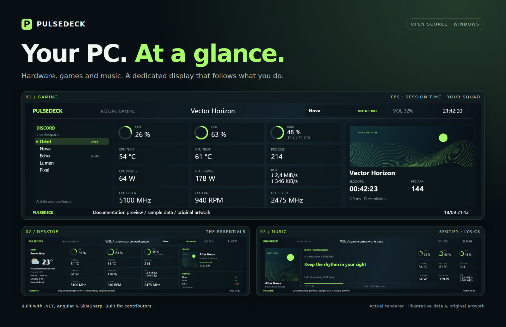

# PulseDeck · Il tuo PC, a colpo d’occhio

PulseDeck è un progetto open source per trasformare il display USB **TURZX 8,8″ 1920×480** in un pannello per Windows: sensori hardware, giochi, Discord e musica, con profili che cambiano in base a quello che stai facendo.

Il configuratore e il display usano lo stesso renderer. L’agent gira sul PC; non serve un account PulseDeck. Le integrazioni opzionali interrogano i rispettivi servizi esterni. L’interfaccia è attualmente in italiano; la documentazione principale è in inglese per facilitare i contributi internazionali.

## Integrazioni a colpo d’occhio

  
  
  

  
  
  

Le etichette indicano funzioni specifiche di PulseDeck; alcune richiedono una configurazione opzionale. Aura usa un ricevitore sperimentale installato separatamente, verificato sul PC di sviluppo con colori statici e Ciclo colori. Una build sperimentale a 16 zone riceve anche i colori simultanei di Arcobaleno e li applica alla scritta PULSEDECK, al testo attivo e all’avanzamento del brano; ogni barra dei sensori mantiene un colore uniforme.

*Integrazioni indipendenti della community. Non vengono dichiarate sponsorizzazioni, approvazioni o certificazioni dei produttori. I nomi appartengono ai rispettivi titolari; questi badge testuali non sono loghi ufficiali.*

## Da dove nasce

L’idea è partita da [Discord Overlay](https://github.com/cicarulez/discord-overlay), per vedere i partecipanti al canale vocale durante il gioco. I limiti incontrati con gli overlay, comprese le restrizioni degli anti-cheat, hanno portato a spostare queste informazioni su un display esterno. Da questa esigenza è nato PulseDeck, aggiungendo sensori hardware, sessioni di gioco, immagini e musica.

## Cosa puoi fare

- **Desktop:** CPU/GPU/RAM, temperature, watt, ventole, frequenze, rete, meteo e news.
- **Gaming:** rilevamento Steam/EA, immagini, FPS, timer che continua durante Alt-Tab e attività vocale Discord.
- **Musica:** copertina Spotify, testi sincronizzati opzionali e nove sensori in una griglia 3×3.
- **Aura Sync:** accenti e barre seguono i colori del PC tramite il ricevitore sperimentale, con ritorno al colore manuale se non disponibile.
- **Configurazione:** widget, profili, sfondi, anteprima e collegamento del display dal browser.

Il progetto è in sviluppo iniziale. Il modello verificato è `chs_88inch.dev1_rom1.90`, USB `0525:A4A7`; gli altri modelli non sono ancora supportati. Le immagini della documentazione usano il renderer reale con dati dimostrativi e contenuti originali.

## Da dove partire

1. Segui la [guida di avvio](getting-started.md) per ottenere il pacchetto Windows completo.
2. Esegui `Start-PulseDeck.cmd` e apri **http://127.0.0.1:5178**.
3. Configura i sensori e prova l’anteprima. Per alcune letture servono PawnIO e privilegi amministrativi.
4. Chiudi il programma TURZX prima di collegare il pannello con PulseDeck. La porta COM va scelta sul tuo PC.

L’anteprima funziona anche senza display. Non servono SDK o Node.js per eseguire un pacchetto già compilato.

## Vuoi contribuire?

Sono utili contributi su interfaccia e traduzioni, test su altri PC, affidabilità USB, selezione delle sessioni multimediali e documentazione. Puoi lavorare ai test e al configuratore anche senza il pannello fisico.

- [Guida per contribuire](../CONTRIBUTING.md)
- [Galleria](gallery.md)
- [Roadmap](roadmap.md)
- [Privacy e dati locali](privacy.md)
- [Prove effettuate](validation.md)
- [Apri una segnalazione](https://github.com/cicarulez/PulseDeck/issues)

Se vuoi sostenere economicamente lo sviluppo, puoi [offrirmi un caffè](https://buymeacoffee.com/cicarulez). Sono altrettanto benvenuti codice, test, documentazione e suggerimenti.

Licenza **GPL-3.0-or-later**. Vedi [LICENSE](../LICENSE) e [attribuzioni](../THIRD-PARTY-NOTICES.md).
