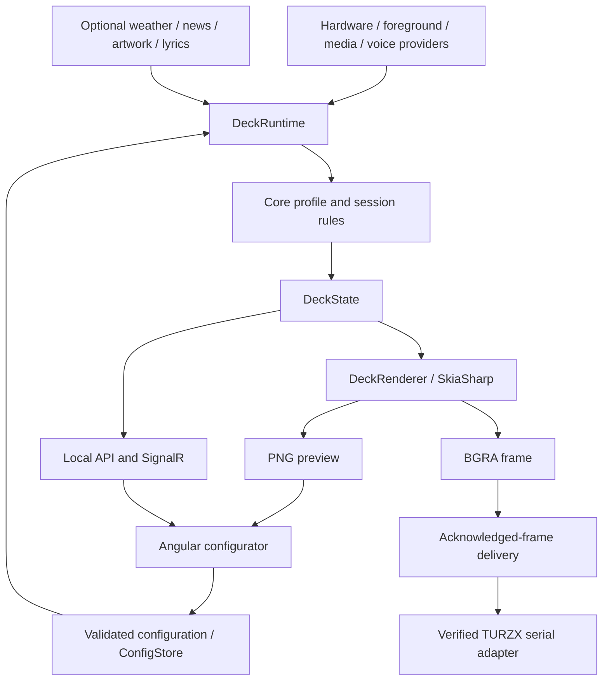

# Architecture

PulseDeck separates acquisition, portable state rules, rendering and transport. It runs in the signed-in Windows session because foreground windows, media sessions and DPAPI are user-scoped.

## Runtime flow

## Projects and boundaries

- **`apps/agent`** owns Windows integration, provider lifetimes, the local ASP.NET Core API, rendering and serial delivery.
- **`src/PulseDeck.Core`** contains portable contracts, validation, game/library parsing, profile selection, lyrics parsing, widget resolution and frame protocol/recovery rules.
- **`apps/configurator`** edits configuration and shows state/preview. It does not reproduce the panel's rendering logic.
- **`src/PulseDeck.Discord`** builds pinned upstream WebSocket source with a documented roster fix. See its [provenance](../src/PulseDeck.Discord/README.md).
- **`apps/youtube-extension`** is an optional local YouTube main-player source with Windows media fallback, plus opt-in focused Chrome tab favicons. Native foreground titles work independently; favicon metadata must be fresh and match the native tab title.
- **`apps/desktop`** is an optional Electron wrapper around the same local configurator.

## Profiles and media identity

Automatic selection favors a recognized foreground game, then playing media, then Desktop. Candidates must survive the configured debounce. Manual selection applies immediately. Spotify's exit to Desktop has a minimum eight-second grace period to cover brief track transitions; Gaming retains its normal entry delay.

Game session identity includes PID and process start time. The timer measures the lifetime of the current process session, surviving Alt-Tab without merging reused PIDs. Automatic discovery matches executable paths from local Steam/EA metadata, with explicit manual overrides.

Windows media is the baseline source. The optional YouTube bridge identifies the main player and prefers playback to paused sessions; it expires to the Windows fallback. Spotify lyrics require a Spotify Windows media identity and an eligible track. Requests validate title, artist and duration, cache matches locally and clear stale text on track/source changes. Loading/track gaps keep the selected Music composition stable.

## Providers and unavailable data

Providers produce typed snapshots, including status and diagnostics. Sensor updates preserve healthy devices when another fails. Raw sensor ID **and name** distinguish collisions. Missing readings stay unavailable; zero is a value, not evidence of failure.

Configured LPC sensor loss can trigger bounded motherboard-only reinitialization when PawnIO and elevation are available. This does not change fan curves or acquire RGB control.

Speaking is an explicit voice event, not the inverse of mute/deaf. Every Discord roster highlights speakers only when the voice connection is available. Voice membership follows the tracked user in the configured channel, independently of the active profile; without a tracked ID it follows human occupancy. The legacy `gamingVoiceActivity` setting remains the opt-in switch. Streaming is a separate Gateway flag and does not depend on voice availability. Desktop expands Discord into the media area while the tracked user is in the connected roster (or the roster is nonempty without a tracked ID) and no media session is connected; paused sessions retain their panel. The header hides the tracked member when absent from the connected roster.

PresentMon collection is prepared before protected games launch. Discovery changes should not restart a healthy collector while a game is running. Metrics are application-presented FPS/frame times; status distinguishes unavailable or unprepared collection.

Google Calendar reads a DPAPI-protected iCal URL using an HTTP client with request logging disabled. Its fetch and Ical.Net recurrence evaluation run outside the render loop with one pending task, bounded feed/occurrence sizes and source-change cancellation. A pending response cannot overwrite a different calendar selection. URLs never enter API snapshots; only bounded appointment titles/times do.

Weather, news, lyrics and artwork use bounded asynchronous requests, cancellation and cache policies. They must not substitute unrelated stale content. More data-flow details are in [privacy](privacy.md).

## Rendering

`DeckRenderer` produces a 1920×480 BGRA frame and PNG preview from the same state/configuration. Desktop, Gaming and Music share widget resolution and drawing. Fixed-slot layouts retain hidden bindings when switching compositions. Music displays the first nine slots in a 3×3 grid.

The normal update target is roughly 1 Hz. Serial delivery is synchronous, so slow providers or writes can reduce cadence. There is no high-refresh animation queue. Images are local or runtime-cached resources; proprietary artwork is not part of the source distribution.

The [documentation generator](../tools/docs-gallery/README.md) compiles this renderer with synthetic snapshots. It never calls production providers or writes to a panel.

## Display transport

`TurzxDisplay` validates VID/PID and HELLO identity before sending an initial full frame. `TurzxFrameDelivery` owns the acknowledged baseline and bounded recovery policy in portable Core code. Partial rectangles are computed against an acknowledged frame; failed sends never become the next baseline.

A `needReSend:1` reply invalidates the baseline and schedules a full frame. A recurring resend, timeout or malformed reply can require closing/reopening and revalidating the device. Recovery permits two attempts with minimum delays of 2 and 5 seconds, replenished after 60 consecutive acknowledged frames. It does not queue stale frames or loop indefinitely.

Explicit disconnect cancels pending recovery and startup reconnect attempts. Recovery does not wake standby devices; the explicit connection path handles the tested standby identity before validating the awake device. Shutdown blocks new work and attempts screen-off. No firmware is written.

The full-frame command `C8 EF 69 00 38 40 0E 10` is covered by regression tests. Protocol changes need actual device evidence. See [hardware compatibility](hardware.md) and [validation](validation.md).

## Local API and storage

The host binds to `127.0.0.1:5178`; SignalR `/live` publishes snapshots. Representative endpoints are `/api/state`, `/api/config`, `/api/preview.png`, `/api/sensors`, `/api/display` and `/api/games`. Mutations use the configurator client header and origin checks. This is a local trusted-user API, not a public authenticated service.

Configuration, credentials and caches belong in `%LOCALAPPDATA%\PulseDeck` or `PULSEDECK_DATA_DIR`. Discord and SteamGridDB credentials use DPAPI CurrentUser and are not returned by API responses. Automatic startup is an elevated interactive-user task, not a service in session 0.

## Validation boundaries

Core tests cover portable parsing, selection and protocol state. Rendering tests exercise real Skia output and cache behavior. Extension and Electron tests cover their local policies. Build success does not prove Windows media access, accurate sensors, real speaking events or a correct physical picture; those require documented integration observations.
