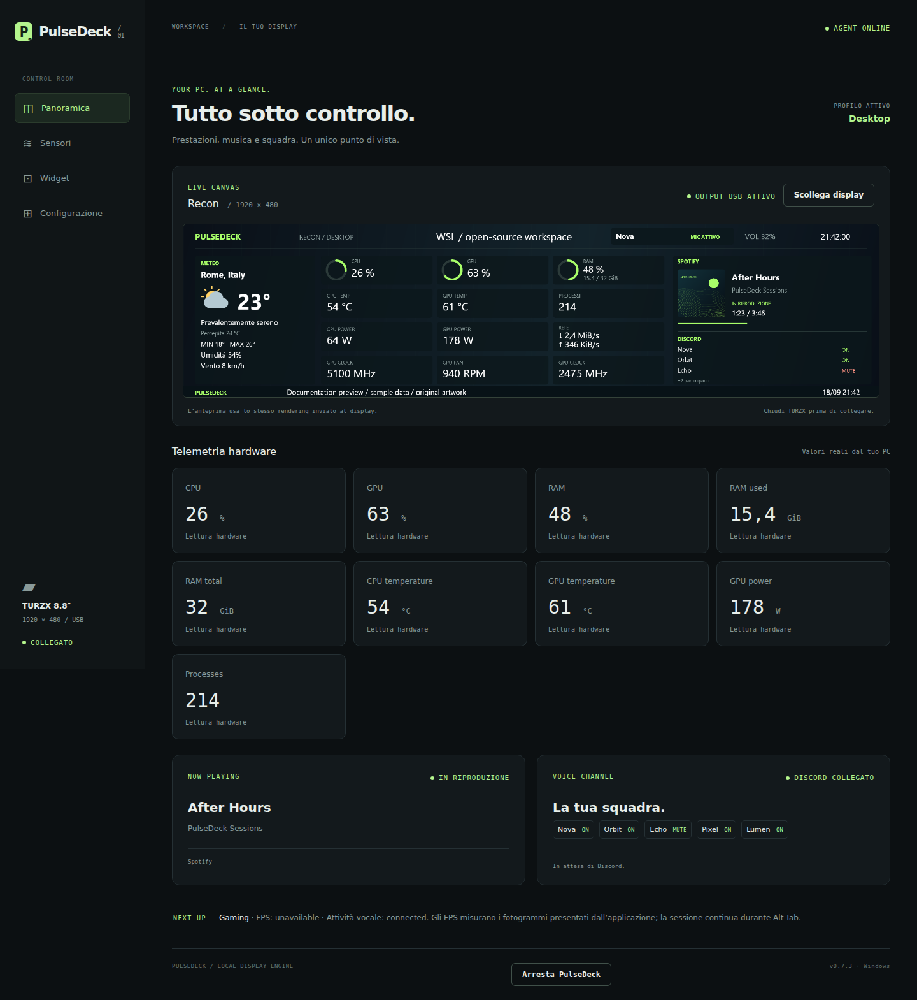
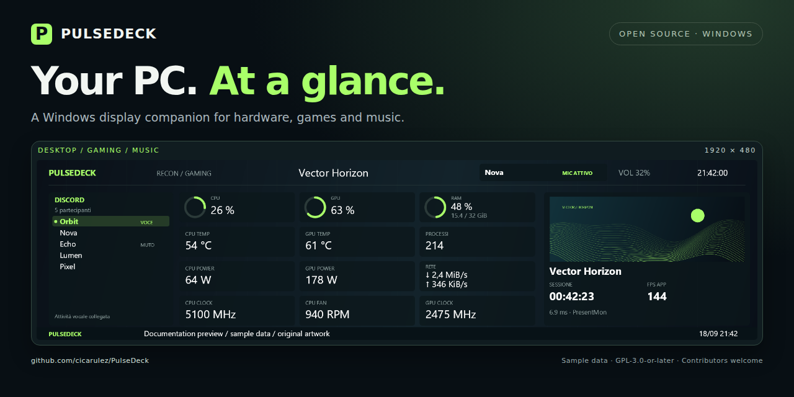

# Gallery

These images show **PulseDeck's production renderer and actual Angular configurator**, supplied with isolated documentation fixtures. They are not concept mockups or photographs of the physical screen.

All readings, participant names, track/game titles and lyric lines are illustrative. The game and album art are original procedural graphics created by the gallery tool. No user screenshots, account information, downloaded lyrics or commercial game/album covers are included. Sensor values and FPS are not performance claims.

## Desktop

Weather, twelve sensor widgets, a media card and Discord roster. Other base layouts support sixteen or eight sensor slots.

## Gaming

Voice activity, sensors, original sample game artwork, elapsed session time and application FPS. The fictional game **Vector Horizon** is a fixture, not a compatibility claim.

## Music

Spotify-style track state, original sample lyric lines and nine sensors. The RAM ring shows only the percentage in this composition.

## Configurator

The current UI is in Italian. This capture runs the built Angular app against an isolated fixture server, not a user's agent. The fixture's connected status does not claim a physical device was attached during capture.

## Sharing

`social-preview.png` is 1280×640 and can be uploaded in the repository's social preview settings. `hero.png` is used at the top of the README.

## Reproduce or update the images

Use [tools/docs-gallery](../tools/docs-gallery/README.md). Its C# project links the production renderer; its Playwright script captures the production configurator and composes the project cover. It never connects to the real agent or writes to a display.

The committed panel screenshots were rendered on Windows to use the same Segoe UI typography as the agent. Linux output is also supported, with platform font differences. Documentation images and generator code are covered by the repository's GPL-3.0-or-later license.
