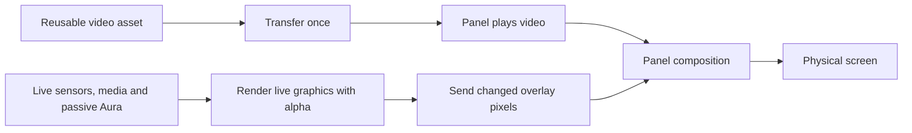

# TURZX internal video playback investigation

Research date: 2026-10-04. Target: `chs_88inch.dev1_rom1.90`,
1920×480 landscape, USB `0525:A4A7`, COM5. The initial study was read-only; subsequent standalone probes uploaded and
played an original test clip successfully, then deleted it and restored PulseDeck.
The attempted live overlay was rejected. Video playback is not enabled in production.

## Findings and confidence

| Evidence | What it establishes | Remaining uncertainty |
| --- | --- | --- |
| User saw smooth AMD animation, continuing after vendor playback was stopped and the UI showed Run | The physical screen can show motion substantially smoother than PulseDeck's current live path | Run alone does not prove absence of background USB traffic |
| Bundled AMD MP4 is H.264, 480×1920, encoded at 24 fps | Identifies a plausible portrait video asset for that theme | Encoded fps is not measured physical playback fps |
| Vendor application exposes file upload, start/stop video playback and separate image-update operations; its guide describes transferring videos into screen storage | Internal media playback is a separate mechanism from live bitmap delivery | Storage targets, commands and replies must be verified for this ROM |
| Vendor rendering code can clear to transparent and sends image differences while a video is configured | Supports a video background plus live graphics interpretation | Alpha encoding, layer lifetime and erasure behaviour remain unverified on our unit |
| Current PulseDeck renderer clears to opaque colour and draws a full background | Its existing output would obscure a video beneath it | An overlay renderer cannot be enabled by changing transport alone |

Private vendor inspection files and media remain outside source control. These
notes describe observations, not copied proprietary implementation.

## Proposed rendering model

The benefit would be removing repeated USB delivery of predetermined motion.
It does not make arbitrary live data run at video speed. A prerecorded rainbow
cannot replace passive Aura following; audio-spectrum bars, song progress and
lyrics must still follow actual provider state.

Good initial candidates are a subtle background or a reusable arrival animation.
A mail animation also needs correct start, stop and return behaviour: looping a
video indefinitely is not equivalent to an arrival event. It is not yet known
whether playback can be confined to a rectangle, layered independently, or only
used as a full-screen background. Do not promise a localized envelope animation
until these constraints are tested.

## Fit with the current code

- `DeckRenderer.Render` currently creates premultiplied BGRA pixels, clears to an
  opaque base and draws the background before content. Preserve its current
  behaviour until a separate composition mode is physically validated.
- `TurzxProtocol.FullFrame` and the ROM >88 partial encoder preserve four bytes
  per pixel. This is a transport opportunity, not proof that firmware accepts
  Skia's premultiplied alpha directly. Test alpha 0, 255 and intermediate values,
  including clearing the area previously occupied by a moving glyph.
- `TurzxFrameDelivery` compares the last acknowledged host image. In a future
  overlay mode, that baseline must represent the overlay rather than decoded
  video frames, and be invalidated on playback/layer changes and reconnects.
- Keep the preview and physical output on the shared renderer: a future preview
  must compose the same live overlay with the selected clip, rather than show an
  unrelated opaque dashboard.
- Keep the verified full-frame command unchanged. High-rate partial stability
  remains an independent issue; internal playback does not establish its repair.

## Diagnostic gates

1. Establish this ROM's upload/playback/status contract from manufacturer guidance
   or a bounded capture of ordinary vendor video operations. Separate volatile
   RAM from persistent storage and document file/path and size limits. Do not
   guess commands or use firmware/update operations.
2. Build an isolated diagnostic with explicit verified USB/HELLO identity checks,
   exclusive port ownership and cleanup. Use a small original test clip outside
   the repository; do not redistribute the AMD asset.
3. Validate video-only playback and measure the physical motion separately from
   USB throughput. Determine loop, stop and playback positioning behaviour.
4. Add one live overlay using real provider state. Verify transparency, orientation,
   updates and complete removal of old glyphs while the video keeps moving.
5. Run a sustained test, then stop playback and restore the normal PulseDeck
   frame. Verify acknowledgements, reconnect, config and startup preservation.

Only after these checks should production gain optional internal playback. Until
then retain the verified ordinary rendering path and report the feature as an
investigation, not an available acceleration setting.

## Prepared diagnostic asset and brightness follow-up

An [offline generator](../tools/internal-playback-probe/README.md) now creates an
original three-second, 72-frame portrait H.264 clip at 24 fps. The runtime asset
was uploaded to a unique filename on the verified ROM, its stored size was
checked, and playback returned `play_video_success`. The user saw motion smoother
than the live spectrum, but less convincing than the vendor AMD animation. This
does not independently measure physical frame rate. Cleanup returned file size
zero and PulseDeck reconnected with brightness still 25%.

The separate live-overlay diagnostic reads actual CPU load and attempts CA/D0
initialization followed by an 18-byte CC header with a visibility map. It is not
part of the agent. Initialization returned `seq_png_init_sucess`, but the first
CPU update timed out with counter zero. A retry seeded from the returned device
counter received `needReSend:1`; neither trial established correct composition.
Both cleaned up their own clip and restored the ordinary connection. The next
unresolved gate is the 8.8-inch overlay contract, including count, pixel encoding,
visibility and frame-state semantics. Do not report this as available acceleration.

The user also reported noticeably increased brightness after the vendor trials.
At the time of that observation PulseDeck had no brightness setting or command,
so reconnecting did not restore an earlier brightness. No Reset/Restore operation was selected in
the trials. Vendor configuration applying its own value is a plausible cause,
not a measured explanation. The public revision-C brightness operation maps
0–100 percent to one byte (0–255); this provides a separate implementation path.
An optional `DisplayBrightness` setting and configurator slider are now
implemented: null keeps the panel value; a saved percentage is validated, sent
under the serial gate and reapplied after validated reconnects. The user confirmed
physical brightness changes and selected 25%; a reconnect preserved the setting
and reapplied the command without errors. No independent luminance measurement
was made.

## Public source checks

- [Upstream revision-C implementation](https://github.com/mathoudebine/turing-smart-screen-python/blob/main/library/lcd/lcd_comm_rev_c.py): includes video/media stop commands and four-byte BGRA updates for ROM >88. It does not provide a ready-to-use upload/playback integration in this file. Alpha byte transport alone does not validate composition.
- [InfoPanel serial delivery](https://github.com/habibrehmansg/infopanel/blob/1.4.x/InfoPanel/Services/TuringPanelSerialTask.cs): uses full bitmap and changed-sector updates. It does not demonstrate the proposed internal-video/overlay path.
- [InfoPanel USB delivery](https://github.com/habibrehmansg/infopanel/blob/1.4.x/InfoPanel/Services/TuringPanelUsbDeviceTask.cs): stops media to avoid flickering before its live-frame loop. This is another device path, not proof of compatible commands or performance on our serial unit.
- [Video-support PR #348](https://github.com/mathoudebine/turing-smart-screen-python/pull/348), still open/unmerged when checked: supplies file operations, video start/stop, a transparent overlay and a separate visibility map. Its reference implementation targets a 5-inch screen and contains dimension-specific initialization. Pin studied source to commit `58aa2f21515019d1e9ed66263c243e36e29bba43`; do not execute its example unchanged on the 8.8-inch panel. The author reports resend/freeze problems when the final USB chunk ends or begins with particular terminator/padding combinations and adds a dummy segment to avoid them. This is a specific candidate explanation for earlier partial failures, not a verified fix on ROM 1.90. Overlay visibility information and alpha handling require more than changing the renderer's background to transparent.
- [Official forum protocol discussion](https://discuz.turzx.com/d/4162-turzx-updatevideo-protocol): contains a developer request for update/video protocol and an administrator's invitation to adapt the devices. It is not a published protocol specification or confirmation for this unit.

See [physical validation](validation.md) for the measured live-frame results
and the [roadmap](roadmap.md) for the next refresh experiments. Desktop Mode compatibility remains a separate unresolved question.
